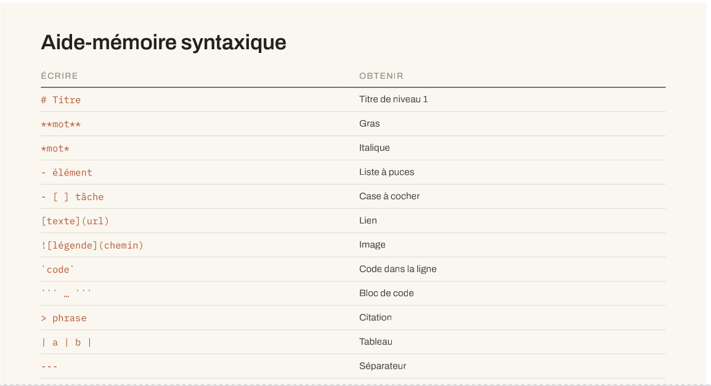

# Journal - lundi 24 août 2026 (rédigé par AKATA Richard)

## Fait aujourd'hui

* Présentation d'introduction du Module UC2-M3. Principes, pratiques et gestion de projet par KAMEKPO Komlan Giovanni.

* Étude de l'importance de documenter et découverte du calendrier des jalons.

* Découverte des outils : VSCode, Git, GitHub, GitHub Pages.

* Étude des syntaxes de base du langage Markdown .

## Appris

* La différence entre un rapport et une vraie documentation.

| La documentation, ce n'est pas | La documentation, c'est |
|---|---|
| Un rapport écrit à la fin | Une trace écrite le même jour |
| Un récit des réussites | Un relevé, échecs compris |
| Un texte | Texte + fichiers sources + paramètres + photos |

* L'écriture dans **VSCode**, l'historique local dans **Git**, le partage en ligne sur **GitHub** et la publication sous forme de site web via **GitHub Pages**.

* Le langage Markdown offre une lisibilité durable à 10 ans et permet des modifications simultanées en équipe (sans conflit de version).

## Raté puis corrigé

* **Lien d'image cassé :** L'image de l'aide-mémoire ne s'affichait pas dans l'aperçu. J'avais utilisé un chemin propre à mon ordinateur (`/home/tim/...`) et le nom du fichier contenait des espaces et accents.
* **Correction :** J'ai utilisé un chemin relatif (`../medias/`) indispensable pour GitHub, et j'ai renommé le fichier sans espaces et sans accents (`Aide-memoire-syntaxique.png`) pour assainir le code.

## Décidé

* **Règle pour nommer des fichiers :** Bannir définitivement les espaces, les majuscules et les caractères accentués dans le nom de tous les futurs fichiers et images (ex : utiliser uniquement le format `nom-du-fichier.png`).
* **Choix des chemins :** Utiliser exclusivement des chemins relatifs (`../`) pour garantir le passage du projet entre mon ordinateur local et les serveurs de GitHub.

## À faire demain

* Initialisation des dépôts.

* TP : Journalisation.

* Réviser les syntaxes de Markdown.

