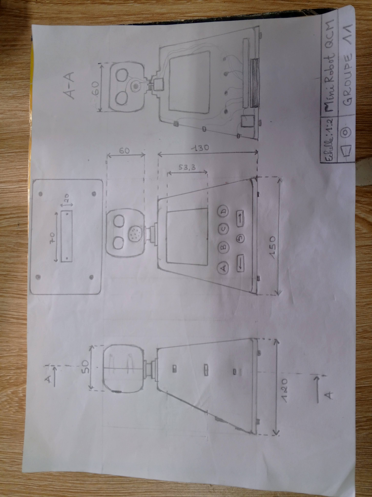

# Journal — mercredi 02 septembre 2026 (rédigé par : Richard AKATA)

## Fait aujourd'hui

### Électronique

* Assemblage intégral du robot mBot2 à partir des pièces détachées.
|||
* Rédaction d'un programme dans mBlock destiné à faire avancer le mBot2 lorsqu'une touche est actionnée sur la CyberPi.

* Rédaction d'un second programme dans mBlock permettant au mBot2 d'avancer lorsqu'une touche est actionnée sur la CyberPi, et de changer de direction dès lors qu'un obstacle se présente sur sa trajectoire.

### Algorithmique débranchée

* Définition de la notion d'algorithme.
* Aperçu historique de l'algorithme.
* Introduction à l'algorithmique débranchée.
* Réalisation d'un exercice consistant à récupérer un trésor. 
Cet exercice devait être résolu au moyen de blocs d'instructions débranchées.

### Projet

* Élaboration d'un croquis de conception. 

## Appris

* Logique de programmation : recours à des blocs de code (ou à des lignes de code) afin d'élaborer des structures logiques.

## Raté, puis corrigé

* Le robot effectuait un mouvement de recul alors que l'instruction lui prescrivait d'avancer, anomalie imputable à une inversion des fiches de connexion des deux moteurs. Ce dysfonctionnement a été résolu en substituant, dans un premier temps, l'instruction « avancer » par « reculer », puis, dans un second temps, en rétablissant le branchement correct des fiches entre les deux moteurs.

## Décidé

*

## À faire demain

* Ajuster, lors de la prochaine séance, les variables du programme dans mBlock (vitesse du robot, distance de détection du capteur) afin de rendre les deux programmes plus fluides et plus précis.