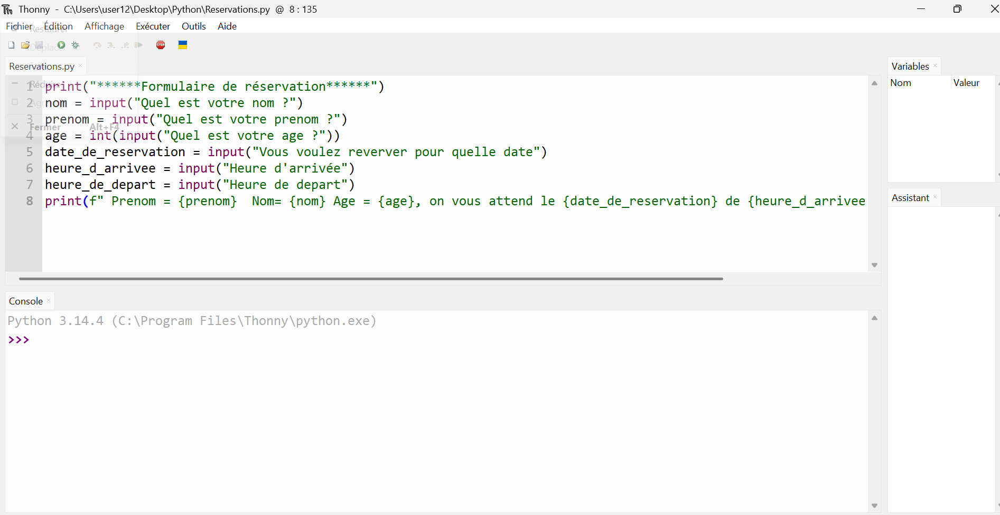

# Journal — mercredi 03 septembre 2026 (rédigé par : Richard AKATA)

## Fait aujourd'hui

### Python pour Fabmanagers

Les fondements de la programmation Python.

* Découverte de l'environnement Thonny.
Volet théorique et exercices pratiques, complétés par un mini-projet de réservations. 

### Projet de soutenance

* Finalisation du choix des composants.

## Appris

* Appréhension de la logique de programmation.
* Rédaction, exécution et débogage d'un script Python.
* Variables et types de données : stockage d'informations à l'aide des types `int`, `float`, `str` et `bool`.
* Interactions : capture des saisies au clavier au moyen de `input()`, et affichage formaté grâce aux f-strings.

## Raté, puis corrigé

* Calculs impossibles (`TypeError`) : blocage survenu lors de la multiplication d'un texte par un nombre. Il en ressort qu'il convient impérativement de convertir la valeur retournée par `input()` à l'aide de `int()` ou `float()` avant tout calcul.

## Décidé

* Rédiger du pseudocode : consigner le plan en langage clair préalablement au codage, afin de structurer la logique des scripts.
* Vérifier systématiquement les variables : activer la vue « Variables » dans Thonny afin de suivre en temps réel l'état de la mémoire.

## À faire demain

* Étudier les structures de contrôle (`if` / `elif` / `else`) afin de rendre les scripts décisionnels.
* Découvrir les boucles, en vue d'apprendre à répéter des tâches de manière automatisée.