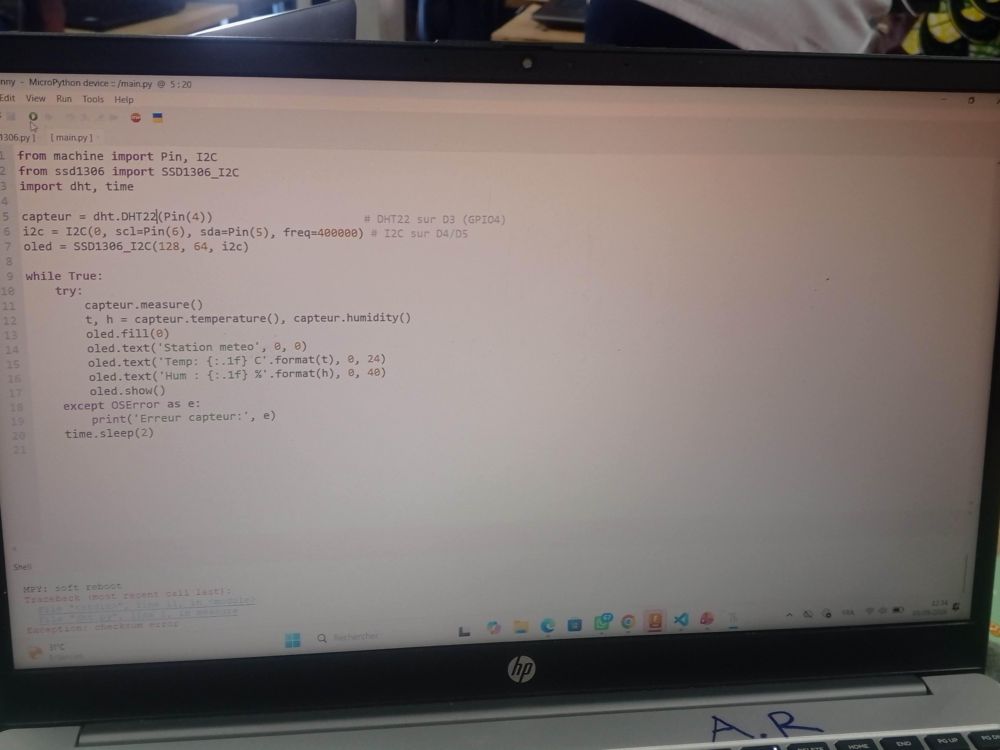
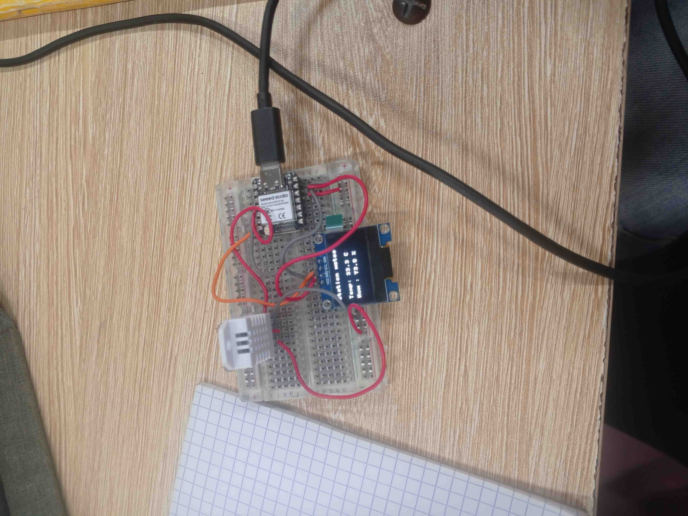

# Journal — samedi 05 septembre 2026 (rédigé par : Richard AKATA)

## Fait aujourd'hui

* Configuration de l'environnement : raccordement de la carte XIAO ESP32S3 au moyen d'un câble USB-C.
* Flashage et préparation : installation réussie du firmware MicroPython adapté à la puce ESP32-S3, ainsi que configuration de l'interpréteur dans Thonny.
* Câblage du prototype : montage sur breadboard du capteur DHT22 (sur la broche D3/GPIO4) et de l'écran OLED SSD1306, au moyen des broches I2C par défaut (D4/SDA et D5/SCL). 
* Installation du paquet externe `micropython-ssd1306` par l'intermédiaire du gestionnaire de paquets de Thonny, afin de piloter l'écran.
* Rédaction, enregistrement (sous le nom `main.py`) et exécution d'un script de test destiné à mesurer et à afficher, en continu, la température et l'humidité toutes les deux secondes.  

## Appris

* La XIAO ESP32S3 est une carte officielle puissante (double cœur, 240 MHz) fonctionnant selon une logique de 3,3 V ; il convient de ne jamais alimenter les modules en 5 V, sous peine de l'endommager.
* Les broches D4 et D5 sont attribuées par défaut au protocole I2C. Il importe d'éviter impérativement l'usage des broches D2, D6 et D7 pour des connexions libres, celles-ci jouant un rôle déterminant lors du démarrage (boot) de la carte.
* Le pilote du capteur DHT22 est directement intégré au firmware MicroPython (`import dht`), tandis que celui de l'écran OLED requiert une installation manuelle dans le dossier `/lib`.

## Raté, puis corrigé

* Aucune erreur n'a été rencontrée ce jour.

## Décidé

* Adopter définitivement le réflexe de consulter le pinout (schéma des broches) fourni par le constructeur avant tout câblage, afin de ne pas endommager la carte (limite stricte de 3,3 V).

## À faire demain

* Reprendre le script `main.py` ligne par ligne et y ajouter des commentaires détaillés, de manière à s'assurer de la bonne compréhension de l'initialisation de l'I2C ainsi que de la boucle de lecture.