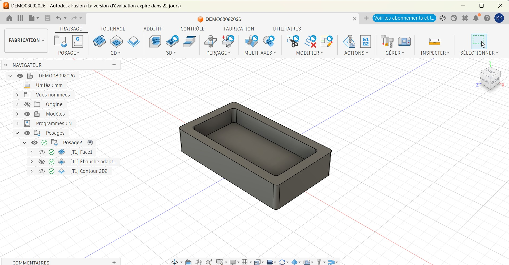
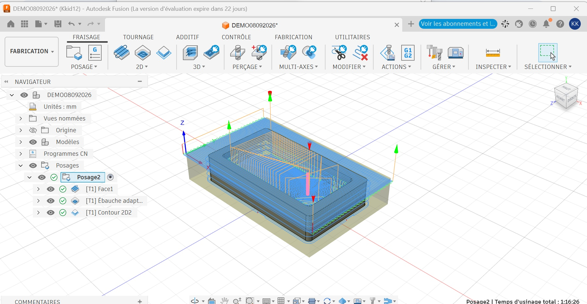

# Journal — mardi 08 septembre 2026 (rédigé par : Richard AKATA)

## Fait aujourd'hui

* Introduction à la FAO : découverte de la Fabrication Assistée par Ordinateur (CAM en anglais) et des différents types de machines.
* De la CAO à la machine : analyse de la chaîne numérique complète (dessin CAO → stratégies FAO → génération du G-code → usinage CNC).  → 
* Étude des machines CNC : compréhension du fonctionnement d'une fraiseuse numérique, de ses axes (X, Y, Z) et de sa broche. Sélection des outils : découverte des différents types de fraises et de leur utilité respective.
* Paramètres de coupe : analyse théorique des vitesses d'avance et des vitesses de rotation de la broche.
* Projet de groupe : finalisation du choix des composants.

## Appris

* La FAO relie la conception à la fabrication.
* Le rôle pivot de la FAO : elle constitue le pont indispensable entre le virtuel (CAO) et le réel, en convertissant des volumes géométriques en trajectoires d'outils.
* Le G-code : compréhension du fait que la machine CNC ne lit pas un dessin, mais un fichier texte contenant des coordonnées de mouvements (commandes G0, G1, G2, G3).
* Importance de la fixation : la rigidité du brut (la matière première) sur le plateau s'avère déterminante afin d'éviter les vibrations et la casse d'outil.
* Le point zéro (origine WCS) : compréhension de la nécessité de définir un point de référence (X0, Y0, Z0) commun entre le logiciel de FAO et la machine réelle.

## Raté, puis corrigé

* Aucune erreur n'a été rencontrée durant cette phase d'introduction.

## Décidé

* Simulation systématique : il a été décidé de toujours procéder à une simulation visuelle 3D de l'usinage dans le logiciel de FAO avant d'envoyer le code à la machine, afin d'éviter toute casse.
* Création d'une bibliothèque d'outils : configurer une liste précise des fraises disponibles dans le logiciel, assortie de leurs paramètres optimaux.

## À faire demain

* Prise en main du logiciel CAM : importer un fichier CAO personnel (par exemple, le contour d'un circuit imprimé ou une pièce mécanique simple) dans le logiciel de FAO.
* Définition des stratégies d'usinage : paramétrer un surfaçage, une poche et un contournage.
* Génération et post-traitement : générer le premier fichier G-code adapté au contrôleur spécifique de la machine CNC cible (par exemple GRBL, Mach3).
* Préparation physique : installer la fraise appropriée sur la machine et procéder au réglage des origines (palpage du point zéro).