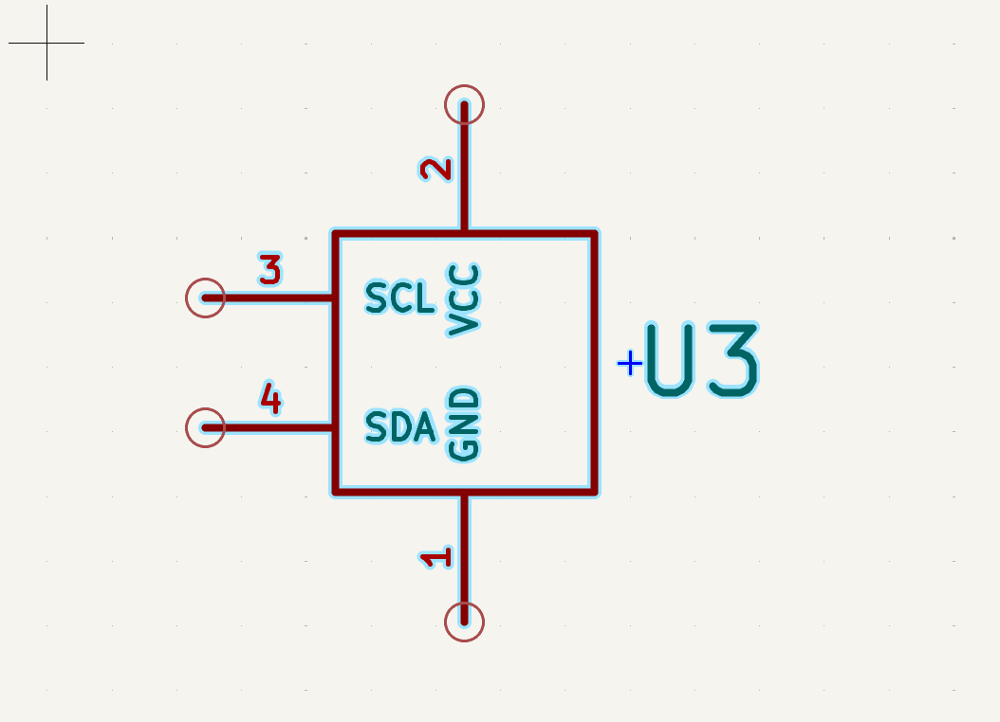
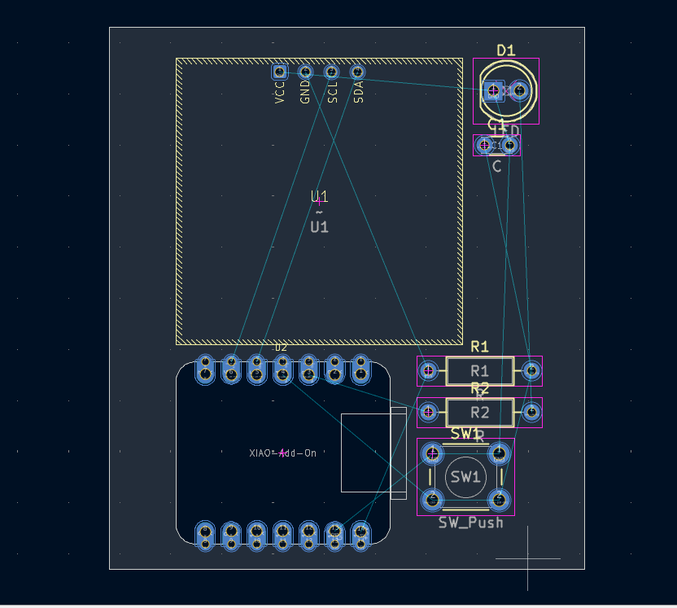

# Journal — mercredi 09 septembre 2026 (rédigé par : Richard AKATA)

## Fait aujourd'hui

* Schéma électronique : réalisation d'un premier jet du schéma sur tableau, afin de visualiser l'ensemble des connexions avant toute saisie informatique, puis reproduction fidèle de ce schéma sous le logiciel KiCad. 
* Librairies KiCad : importation des librairies de symboles et d'empreintes propres à la carte XIAO ESP32S3, nécessaires pour disposer d'une représentation fidèle du composant dans le logiciel de conception.
* Création de composant : dans la mesure où l'écran OLED I2C ne disposait pas de bibliothèque prête à l'emploi, édition et création manuelle d'un symbole ainsi que d'une empreinte personnalisée correspondant précisément aux dimensions et au brochage réels du composant.   

* MicroPython : début du cours officiel consacré à ce langage, permettant d'aborder ses concepts de manière plus structurée et approfondie. Il convient de rappeler qu'un projet antérieur avait déjà mis en œuvre MicroPython, mais de façon plus empirique et moins théorique.

## Appris

* Importation et gestion de librairies externes dans KiCad : compréhension du processus permettant d'intégrer des bibliothèques de symboles et d'empreintes non fournies nativement par le logiciel.
* Création d'un symbole et d'une empreinte de A à Z : maîtrise des étapes nécessaires à la conception d'un composant personnalisé, depuis la définition de ses pastilles et de son brochage jusqu'à son association avec le symbole schématique correspondant.

## Raté, puis corrigé

* Conflit de broche : lors de la conception du schéma, il est apparu que la broche D4 était sollicitée simultanément par le bouton-poussoir et par la ligne SDA de l'écran OLED, ce qui rendait le circuit inopérant en l'état. Ce conflit a été résolu en déplaçant le bouton sur la broche D3, libérant ainsi les broches D4 et D5, dédiées au bus I2C, pour l'usage exclusif de l'écran OLED.
* Essai de routage du PCB : une première tentative de tracé des pistes a fait apparaître des croisements entre celles-ci, ce qui n'est techniquement pas viable sur une carte à une seule face et impose de revoir la disposition des composants.

## Décidé

* Recourir à MicroPython pour coder la logique de l'ensemble des projets à venir, en raison de sa simplicité de mise en œuvre et de sa bonne compatibilité avec la carte utilisée.
* Repositionner les composants sur la carte avant de relier les pistes, de manière à anticiper les croisements et à faciliter un routage propre.

## À faire demain

* Repositionner les composants sur la carte avant de relier les pistes de manière ordonnée, en veillant à optimiser leur disposition pour limiter au maximum les croisements et les longueurs de pistes inutiles.