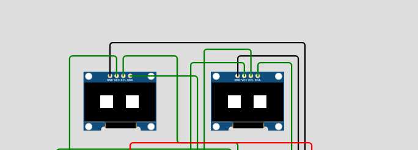
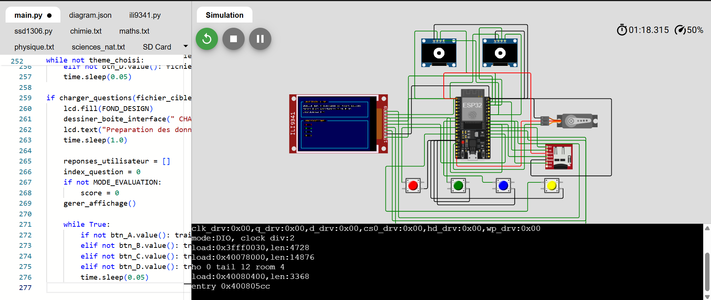
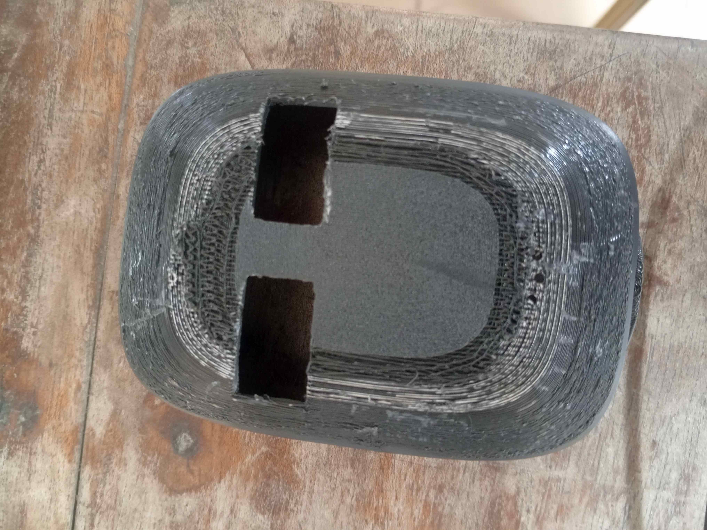

# Journal — lundi 14 septembre 2026 (rédigé par : Richard AKATA)

## Fait aujourd'hui

### Projet de groupe

* Transfert du modèle 3D du corps du robot dans Bambu Studio (logiciel de tranchage), suivi de la configuration des paramètres d'impression.
* Démarrage de l'impression 3D de la base et du corps du robot.
* Modélisation du circuit, ainsi que simulation du comportement et du fonctionnement global du robot sur la plateforme Wokwi.  

## Appris

* Meilleure compréhension des paramètres du logiciel de tranchage (densité de remplissage, supports), permettant d'assurer la solidité du corps du robot tout en optimisant la durée d'impression.
* Utilisation de Wokwi afin de valider la logique du code ainsi que les connexions électroniques avant le montage réel, ce qui permet de tester divers scénarios sans risque pour les composants.

## Raté, puis corrigé

* Un problème d'orientation de la pièce, accompagné de supports manquants, est survenu ; il a été résolu par un réajustement des paramètres de la pièce dans le logiciel de tranchage.
* Un mauvais choix de filament a été effectué, celui-ci étant normalement destiné à la réalisation des supports.
* L'extérieur de la pièce imprimée présente un aspect rugueux. 

## Décidé

* Le comportement du robot en simulation s'est révélé conforme aux attentes, tant en ce qui concerne le circuit que le code associé.

## À faire demain

* Récupérer la pièce imprimée, retirer les supports et vérifier la précision dimensionnelle du corps du robot.
* Monter le servomoteur ainsi que la carte de contrôle, préalablement validés sur Wokwi.
* Téléverser le programme validé dans le microcontrôleur réel et procéder aux premiers tests.