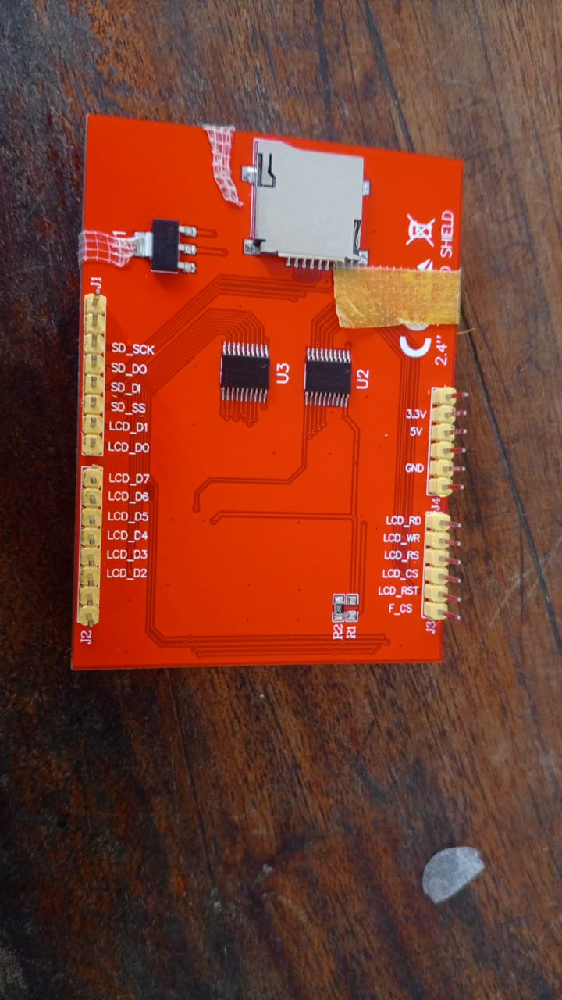

# Journal — mardi 15 septembre 2026 (rédigé par : Richard AKATA)

## Fait aujourd'hui

### Projet de groupe

* Impression 3D finale du corps et de la tête du robot. Le corps est pourvu d'une fenêtre destinée à l'écran ainsi que de quatre orifices réservés aux boutons A, B, C et D ; la tête, quant à elle, comporte deux fenêtres rectangulaires destinées aux écrans OLED faisant office d'yeux, ainsi qu'une grille prévue pour le haut-parleur.  
 
* Montage sur breadboard, comprenant la carte ESP32 DevKit C V4, un servomoteur, des boutons-poussoirs, ainsi que deux écrans OLED (SSD1306). 
* Programmation et test de l'affichage textuel sur les deux modules OLED. 

## Appris

* Compréhension du fonctionnement des adresses I2C, permettant de piloter deux écrans de manière indépendante à partir d'un même microcontrôleur.

## Raté, puis corrigé

* Un conflit d'affichage est survenu ; il a été résolu en raccordant l'un des deux écrans à d'autres broches de l'ESP32, de manière à pouvoir le piloter séparément du second.

## Décidé

* Validation du recours à deux modules OLED SSD1306 indépendants, destinés à animer les expressions du visage du robot.

## À faire demain

* Rédiger le code de balayage, ou d'orientation, du servomoteur, en vue de synchroniser le mouvement de la tête avec les animations des yeux.
* Tester l'insertion physique des écrans et des boutons dans les logements imprimés en 3D, afin de valider la conformité des ajustements.